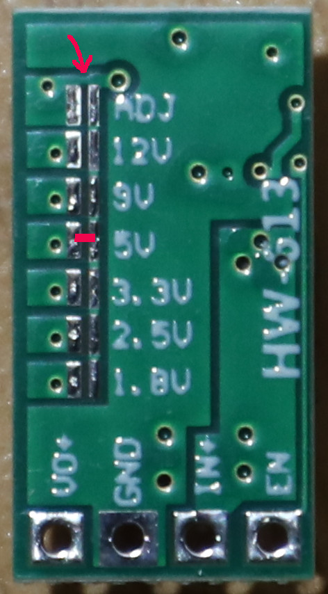

# **Assembly Guide for JUWEI-17 Mount OnStep Open-Source Controller Board**

This document provides detailed instructions and critical considerations for assembling the OnStep controller board for the JUWEI-17 EQ mount. Meticulous attention to component selection and placement is essential for the proper functioning of the board.

## **1\. Introduction**

Before beginning the assembly of this PCB, it is assumed that you have experience with soldering and basic electronics. If you are unsure about any steps, it is recommended to consult with experienced individuals or refer to relevant resources.

## **2\. Special Assembly Notes**

The design of this PCB includes important considerations for component selection and placement. Following these instructions will help prevent assembly errors and component damage.

### **2.1 Certified Wi-Fi/Bluetooth Modules**
This board is designed to be used with Giteki-certified ESP32 or ESP8266 modules for legal operation in Japan. When sourcing modules, please ensure they have the official Giteki mark.

Recommended Modules (with Giteki Mark):

* ESP32: Espressif's ESP32-WROOM-32, ESP32-WROOM-32D, and ESP32-WROOM-32E
* ESP8266: Ai-Thinker Technology's ESP-12F

### **2.2. DCDC Converter (e.g., HW-613) Installation Notes**

The HW-613 DCDC converter module features a jumper (or solder pad) to set its output to a fixed 5V. However, there is a **critical, easily overlooked detail that can lead to significant frustration** (a pitfall I personally encountered during assembly\!): simply closing this jumper is often not enough to fix the output at 5V.

By default, the module is configured for variable voltage output via a potentiometer. To correctly fix the output at 5V, you **must first sever a very fine jumper trace** on the module itself. This trace is often **extremely thin and can appear almost invisible or disguised by the solder mask**, making it easy to miss. It might look like there's no connection there at first glance, but a close inspection will reveal it right next to the pads intended for the ADJ jumper.

**Action Required:** Carefully locate this hidden, fine trace (refer to the image below) and **cut it completely with a sharp hobby knife or scalpel.** Ensure the trace is fully severed.

**Why it's critical:** If this hidden jumper trace is not cut, the module will **fail to fix its output to 5V**, even if you properly close the designated 5V fixed-output jumper. Instead, it will typically output an incorrect, oddly fixed voltage (e.g., around 3.8V), which will prevent the board from operating as expected.

Only after ensuring this hidden trace is completely cut should you proceed to close the designated jumper or solder bridge to set the module's output to a fixed and stable 5V.

### **2.3. Brake Control Circuit Component Selection and Other Considerations**

The PCB footprints for the transistors in this circuit are designed for **through-hole (TH) packages**. While component substitutions *might* be possible, **extreme caution is advised**. When using substitutes, **you *must* verify the datasheet for its pinout, voltage/current ratings, and power dissipation.** Using an incorrect or unsuitable substitute component can lead to malfunction or damage to the board.

a. Bipolar Transistor (NPN \- e.g., S8050 \- TO-92 Package)  
The design is optimized for an S8050 (TO-92). Common general-purpose NPN transistors like 2N3904, BC547, or 2SC1815 may be used as substitutes if their ratings are sufficient for the brake's current requirements and their gain is adequate for the base drive.

* **Critical Pinout Note:** Be acutely aware that **pinouts can differ significantly even for similar transistors in the same TO-92 package\!** For example, while the S8050 (TO-92) often has an Emitter-Base-Collector (EBC) pinout, a very common transistor like the 2SC1815 (also TO-92) typically has an Emitter-Collector-Base (ECB) pinout. The PCB design released in this repository has been updated to accommodate the S8050's EBC pinout. **Inserting a transistor with the wrong pinout will almost certainly damage the component or prevent the circuit from functioning. Always double-check the datasheet for your specific substitute part.**

b. Power MOSFET (N-Channel \- e.g., LR7843, IRF540/IRF520/2SK4017)  
The design is compatible with TO-220 through-hole package N-channel power MOSFETs (or adaptable TO-251 like 2SK4017). Examples include the LR7843 (original in schematic), IRF540 (listed option), or IRF520 (my personal choice). The 2SK4017 (often in TO-251 package) is also a suitable alternative.  
Common solenoid brakes for NEMA17 stepper motors, operating at 12V, typically consume less than 5W. This means they draw approximately 0.42 Amperes (420mA) of continuous current.  
Given this common low current requirement:

* All listed MOSFETs are **more than capable** of handling this continuous current load.  
* Heat dissipation will be **negligible**, so a heatsink is **not required**.  
* The **LR7843** is a "logic-level" MOSFET with very low on-resistance (Rds(on)​), making it highly efficient even with 3.3V logic drive. The IRF520/IRF540 and 2SK4017 also function reliably for this low current, though the IRF series generally prefer higher gate voltages for optimal performance.  
* **Critical Pinout Note:** While many TO-220/TO-251 N-channel power MOSFETs share a common Gate-Drain-Source (GDS) pinout, **always verify the datasheet for your specific substitute part to confirm its pinout** and specifications.

c. Solenoid Protection Diode and Capacitor  
The circuit includes a diode for flyback protection across the solenoid. While the original part number is unknown, any general-purpose Schottky or fast-recovery diode should be suitable. Select a diode with sufficient current and voltage ratings for your solenoid.  
A capacitor (e.g., 0.1uF in my build) is placed in the brake solenoid control circuit for noise suppression. While its exact value is not extremely critical for basic operation, 0.1uF is a common choice for general noise filtering.  

d. Hardware-Controlled Brake System Addendum  
This JUWEI-17 specific board features a fully hardware-controlled brake system. The brake is automatically engaged or disengaged by detecting the ENABLE signal from the motor drivers, meaning no OnStep software modifications, patches, or specific Config.h brake pin configurations are required for this board's brake functionality.

### **2.4. Other Important Assembly Considerations**

a. PCB Mounting & Spacers:  
Some signal traces are very close (approx. 1mm) to the PCB mounting holes. Therefore, using insulating hardware like nylon nuts and spacers is highly recommended to prevent potential shorts, even though the PCB has solder mask and the enclosure might be anodized. (Refer to provided photos for my mounting method).  

b. Connector Orientation & Polarity:  
Pay close attention to connector polarity for all connectors (especially power, motors, and sensors).

* The **brake solenoid connector** is polarity-sensitive.  
* The **RTC backup coin cell holder** also requires correct orientation.  
* While silkscreen markings provide guidance, always double-check with a multimeter if unsure.  
* Motor connector polarity is generally less critical, as motor direction can often be adjusted in the OnStep config.h file.

c. USB Serial IC (CH340):  
The PCB pattern for the USB-to-Serial converter is designed for the CH340G, which typically requires an external crystal and its load capacitors. However, I successfully used a CH340C, which does not require these external components. (My assembly photos reflect this, showing an absent crystal and its capacitors).  

d. LED Current-Limiting Resistors:  
The resistor values for the LEDs were transcribed directly from the original author's schematic. I have set them to allow approximately 7mA of current to flow to each LED.

**Note on Recommended Values:** While the schematic provides initial values, for optimal brightness (assuming red LEDs with ~1.9V forward voltage) and safe operation, the following resistor values are recommended:

* **D2 PWR (Power Indicator):** Change R18 to **470Ω** (from 10KΩ) for ~6.6mA current from 5V.
* **D3 DRV (Drive Indicator):** Change R19 to **220Ω** (from 10KΩ) for ~6.4mA current from 3.3V.

e. Camera Shot Circuit:  
The camera shot control circuit has been tested and confirmed to work with this board. 

**Note on Recommended Values:** The schematic specifies R17 as 1KΩ. However, through personal testing, a **green indicator LED was found to work reliably with a 33Ω resistor**, producing a reasonable brightness. This suggests the specific green LED used has a lower forward voltage than typical datasheet values. A red indicator LED in series with the PC817's internal LED (total forward voltage ~3.1V) would also work, but for more reliable operation with a standard green LED, it is recommended to test with a resistor value in the range of **33Ω to 47Ω**.

f. External Battery Backup (RTC):  
The battery backup for the RTC is external. A standard coin cell (such as CR2032) holder should be connected to the designated connector on the board.  

g. Buzzer (TonePin):  
The board includes a footprint for a buzzer connected to the TonePin. OnStep firmware supports both passive (piezo speaker type) and active buzzers, with selection often configurable in Config.h. For this board, I have successfully tested with a passive piezo type buzzer.

### **2.5. Jumper Settings**

Several jumpers on the PCB control important functionalities. It is crucial to set these correctly for your desired operation. **For the definitive location and function of each jumper, always refer to the KiCad schematic files provided in the repository.**

* **J4 (SHC \- Smart Hand Controller Power):** This jumper is used to **supply power to the Smart Hand Controller (SHC)** if you intend to use one with this board. Ensure it is connected if an SHC is utilized.  
* **J10-J13 (Firmware Upload & USB Selection Jumpers):** These jumpers are critical for both firmware uploading and selecting which processor receives USB communication.  
  * **J10 & J11 (USB RX/TX Selection):** These jumpers select which processor (ESP32 \- main OnStep computer, or ESP8266 \- Smart Web Server) the USB RX and TX lines are connected to.  
    * For **firmware upload**, connect J10 and J11 to the respective processor (ESP32 or ESP8266) you wish to program via USB.  
    * For **normal operation**, J10 and J11 should be connected to the **ESP32 (main processor) side** to allow communication with the primary OnStep controller.  
  * **J12 (Firmware Upload Enable):** This jumper is used to put the selected processor into **bootloader mode** for firmware uploading. It must be set appropriately when flashing firmware to either the ESP32 or ESP8266.  
  * **J13 (DTR Reset):** This jumper is used in conjunction with the DTR (Data Terminal Ready) signal from the USB-to-Serial converter to perform a **reset** on the selected processor, which is often required for initiating firmware uploads.

**Always consult the KiCad schematic for the exact configuration required to enable firmware upload and select the correct processor for USB communication.**
