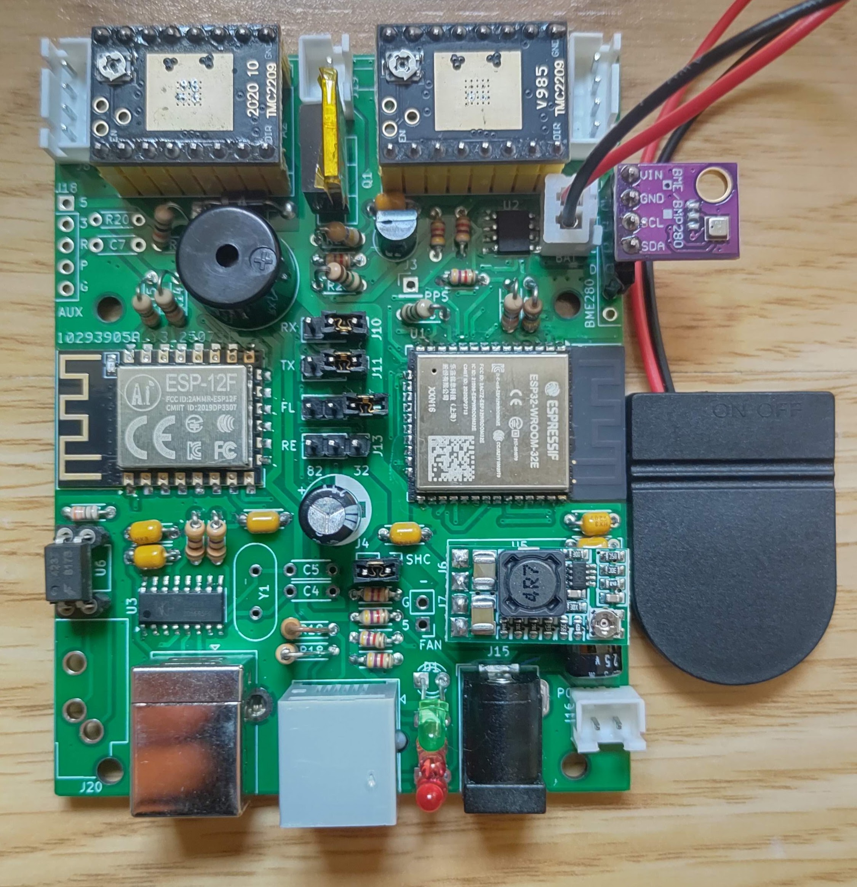
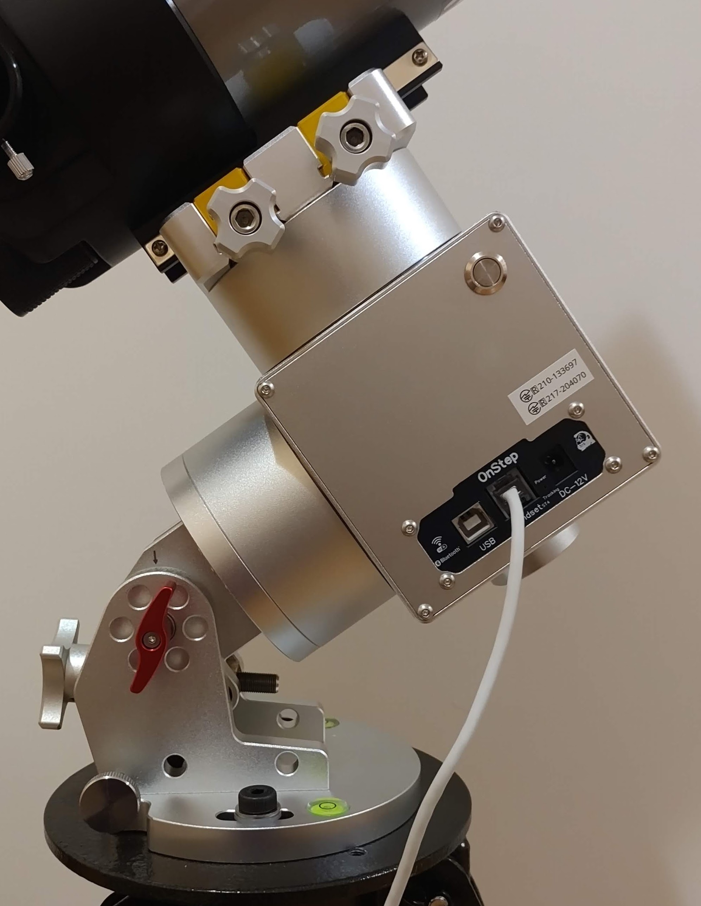
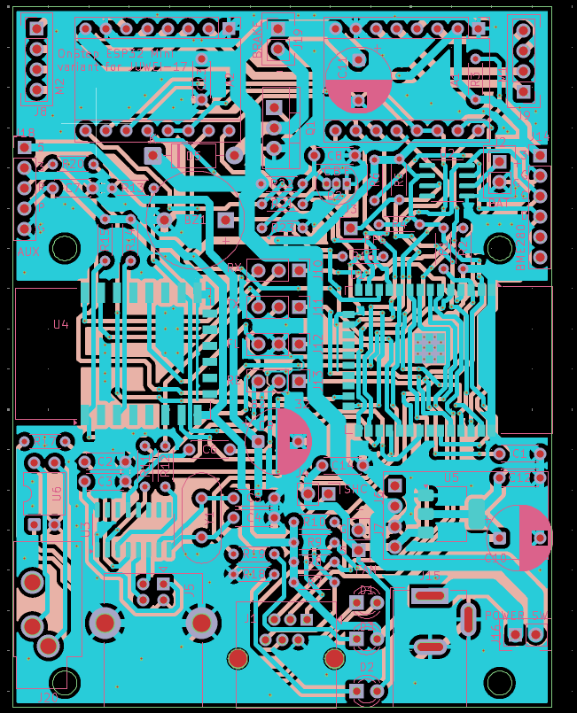
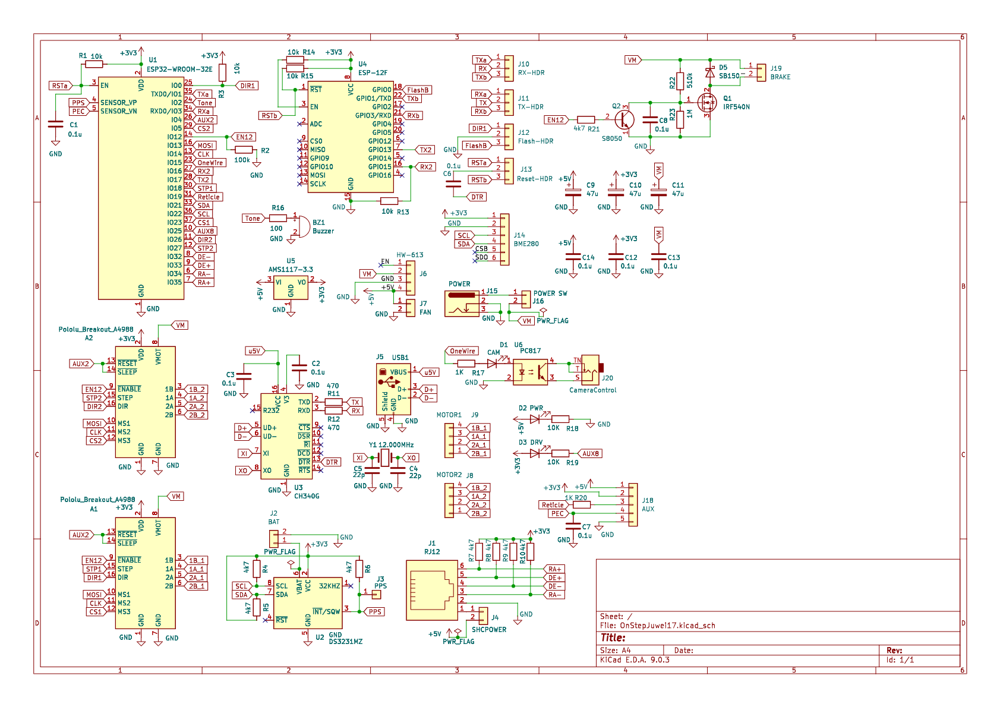
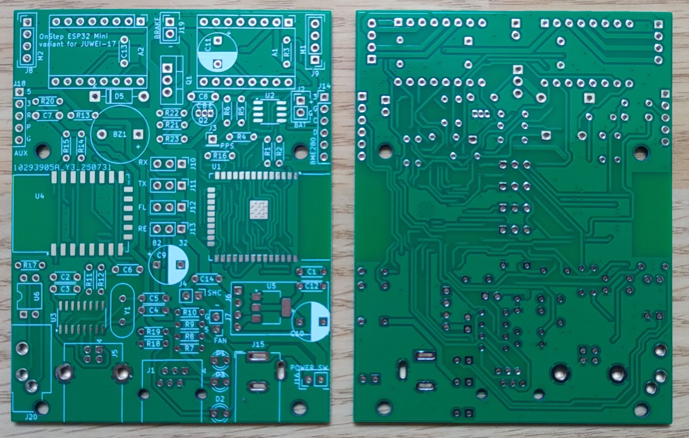

# OnStep-JUWEI-17

## Table of Contents

- [Introduction](#introduction)  
- [Why This Project?](#why-this-project)  
- [Disclaimer](#disclaimer)  
- [Features](#features)  
- [Hardware](#hardware)  
- [Firmware and Config.h Configuration](#firmware-and-configh-configuration)  
- [Usage](#usage)  
- [Licensing](#licensing)  
- [Contribution & Support](#contribution--support)  
- [Contact](#contact)

---

## Introduction

This repository contains the open-source hardware (OSH) design files (KiCad project) for a custom **OnStep-JUWEI-17** controller board specifically tailored for the JUWEI-17 harmonic drive equatorial mount. This board provides a robust and configurable solution for upgrading the JUWEI-17 mount with the powerful OnStep firmware, enhancing its tracking accuracy and GoTo capabilities.

The circuit design is based on Roman Hujer's OnStep ESP Mini project, with specific adaptations for the JUWEI-17 mount — most notably, a hardware-controlled brake system.

---

## Why This Project?

This project addresses a critical issue for users in Japan (and possibly elsewhere):  
The stock JUWEI-17 controller often includes a Wi-Fi/Bluetooth module that lacks Japan's Radio Law certification (技適マーク - Giteki Mark). Operating such a device is illegal in Japan.

This **OnStep-JUWEI-17** project offers a compliant alternative, using certified ESP32 and ESP8266 (ESP-12F) modules that include Giteki certification.  
The goal is to provide a legal, open, and high-performance upgrade path for the JUWEI-17 mount.

---

## Disclaimer

This project involves electronic assembly, including SMD components. Risks include, but are not limited to, electric shock, fire, damage, or injury.

**This project is provided "as is", with no warranty.**  
Use at your own risk. Proper soldering skills and electronic knowledge are strongly recommended.

---

## Features

- Based on Roman Hujer's [OnStep ESP Mini](https://oshwlab.com/hujer.roman/onstep-esp-mini), functionally similar to OnStep MAX ESP3  
- Drop-in installation into the JUWEI-17 mount — no enclosure modifications required  
- Hardware-Controlled Brake System: Uses the ENABLE signal from motor drivers — no firmware tweaks needed  
- Open-Source Hardware: KiCad design files included

---

## Hardware

Custom PCB tailored for the JUWEI-17, based on the ESP32 Mini reference.  
Operates on 12V DC, supporting the original brake solenoid and motor drivers.

Refer to the [ASSEMBLY_GUIDE.md](ASSEMBLY_GUIDE.md) for detailed component list and assembly instructions.

### Manufacturing Files
The complete set of Gerber and drill files required for PCB manufacturing can be found in the [KiCad/gerber/](KiCad/gerber/) directory. These files are ready for submission to a PCB fabrication service.

Location: [KiCad/gerber/](KiCad/gerber/)

---

## **Images**

Here are some visual references for the project.

### **Assembled Board**

### **Installed on JUWEI-17 Mount**

### **PCB Design (Gerber View)**

### **Schematic**

### **PCB image**

---

## Firmware and Config.h Configuration

Uses standard OnStep firmware.  
Circuitry is nearly identical to the OnStep ESP Mini (minus the brake circuit), so you should reference that project for pin definitions and configurations.

---

### Specific Pin Map Settings

The pin map settings for this board are a modification of the standard Pins.MaxESP3.h file. They mirror the specific assignments documented by the [OnStep ESP Mini](https://oshwlab.com/hujer.roman/onstep-esp-mini) project on OSHWLab.

For your reference, the following assignments are replicated on this board:

- Aux7 = 36  
- OneWirePin = 15  
- ReticlePin = 19  
- TonePin = 2  
- PecPin = 39  
- AnalogPecPin = A3  

---

### ⚠️ Note for OnStepX Users

Variable names may differ in newer firmware.  
You will need to adapt these pin definitions to the appropriate structure in your version of Config.h and the corresponding Pins.*.h files.

---

### Gear Ratio Configuration

In Config.h, the gear ratio and motor settings must be exact. Errors will affect tracking and GoTo precision.

#### ⚠️ Important for JUWEI-17: "400:1" May Be Inaccurate

The JUWEI-17 mount is typically advertised with a gear system consisting of a 1:100 harmonic drive and a 1:4 pulley, for a total reduction of 400:1. The motors are standard NEMA17, with a 1.8°/step resolution.

However, based on user-reported data, the actual gear ratio appears to be 404:1, not 400:1.

From [Cloudy Nights post](https://www.cloudynights.com/topic/918425-juwei-17-mounts-on-aliexpress/?p=13665973):

- JUWEI original firmware uses 3591.111 steps/degree  
- Formula: (200 steps/rev × 16 microsteps × **101** x 4) ÷ 360 = 3591.111...

Harmonic drives can have ±1 variation depending on which spline is fixed.  
**Measure your actual gear ratio to ensure accuracy — do not trust online listings.**

---
<!-- TBD
### Sample Config Files

Sample Config.h and Pins.MaxESP3.h files are included in:

`Firmware_Examples/OnStepX_JUWEI-17/`

You must still modify them based on your stepper motors, gearing, and microstepping.

---
-->

### Important Notes on Configuration

- Ensure all pin/motor settings in Config.h and Pins.*.h match your board  
- Always re-upload firmware after making changes

---

## Tested and Confirmed Motor Driver Modules
The following motor driver modules have been successfully tested and confirmed to work with this board. The values in quotes ("...") are the corresponding AXIS?_DRIVER_MODEL settings in Config.h.

- BigTreeTech TMC2130 V3.0: "TMC2130"
- DRV8825 (Brand Unknown): "DRV8825"
- TMC2209 Module included with JUWEI-17 (Legacy Tested): "TMC2209S"

Note: All drivers were tested with 16 microsteps, which is the same setting as the original mount.

---

## Usage

To build and install this controller, follow the detailed instructions in [ASSEMBLY_GUIDE.md](ASSEMBLY_GUIDE.md).

---

## Licensing

This design is derived from the [OnStep ESP32 Mini](https://oshwlab.com/hujer.roman/onstep-esp-mini) project and is licensed under GPLv3.

✳️ _Note:_ Although GPLv3 is suitable for firmware, open hardware often benefits from dedicated licenses like the TAPR Open Hardware License (OHL). These better address physical product concerns such as patents and manufacturing rights.

---

## Contribution & Support

Contributions welcome!  
You can:

- Report bugs via GitHub Issues  
- Submit Pull Requests  
- Join discussion on Cloudy Nights forum

---
